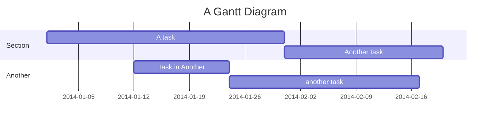
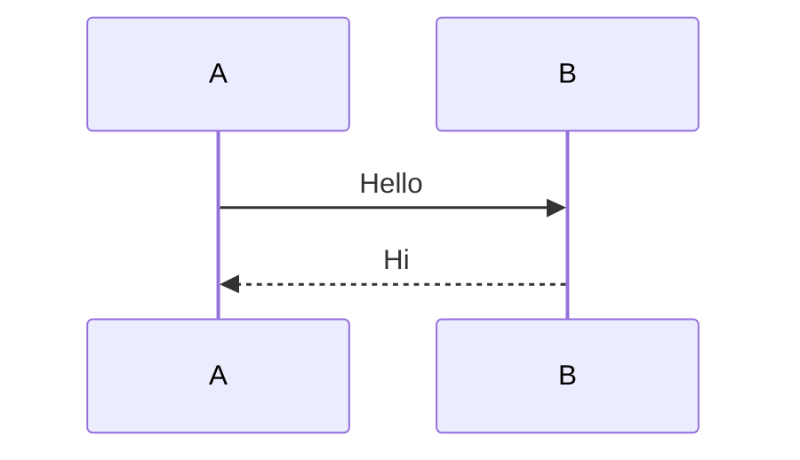

# Elements

Elements added for usage

## Not Found Page

Added not found Page to Layout.

## Image Component

<ImageComponent image-path="/webservices/docker/vm-vs-docker.png" />

## Hero image

## Youtube Embed

<YouTubeEmbed video-id="3Lis4w4_bBc" />

## Mermaid

